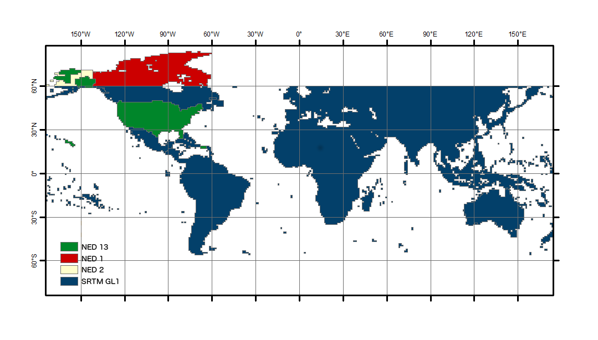

# Digital Elevation Models (DEMs)

ASF uses publicly-available Digital Elevation Models for processing SAR data.
The DEM used will vary by scene location; the best available DEM with full
coverage of the scene extent will be used for processing any given scene.

## DEM Coverage

The source DEMs include:

| Resolution | DEM | Datum | Area | Posting | Sampling |
|------------|-------|--------|------|---------|----------|
| High | NED13 | NAVD88 | CONUS, Hawaii, parts of Alaska | 1/3 arc seconds | Resampled to product spacing, reprojected to WGS84 UTM |
| Medium | SRTMGL1 | EGM96 | 60 N to 57 S latitude | 1 arc second | Resampled to product spacing, reprojected to WGS84 UTM |
| Medium | SRTM US1 | EGM96 | CONUS, Hawaii, parts of Alaska | 1 arc second | Resampled to product spacing, reprojected to WGS84 UTM |
| Medium | NED1 | NAVD88 | CONUS, Hawaii, parts of Alaska, Canada, Mexico | 1 arc second | Resampled to product spacing, reprojected to WGS84 UTM |
| Medium | NED2 | NAVD88 | Alaska | 2 arc seconds | Resampled to product spacing, reprojected to WGS84 UTM |

!!! Note

    For terrain corrected products, the quality of the results is directly related
    to the quality of the digital elevation models (DEMs) used in the process of 
    geometrically and radiometrically correcting the SAR imagery.

The DEMs were pre-processed by ASF to a consistent raster format (GeoTIFF) from the
original source formats: height (`*.hgt`), ESRI ArcGrid (`*.adf`), etc. Many of the
NASA-provided DEMs were provided as orthometric heights with EGM96 vertical datum.
These were converted by ASF to ellipsoid heights using the ASF
[MapReady](https://asf.alaska.edu/how-to/data-tools/data-tools/#mapready) tool named
`geoid_adjust`. The pixel reference varied from the center (pixel as point) to a
corner (pixel as area). For terrain corrected products, the GAMMA software uses
pixel as area and adjusts DEM coordinates as needed. Where more than
one DEM is available, the best-resolution DEM is used for processing. DEM coverage
of at least 20% from a single DEM source is required for processing to proceed.

<!-- ## DEMs Under Evaluation

ASF is currently working to make these DEMs available:

- the Copernicus Land Monitoring Service EU-DEM (EUDEM)
- the Greenland Ice sheet Mapping Project DEM (GIMP)
- and the Reference Elevation Model of Antarctica DSM (REMA)
- Interferometric Synthetic Aperture Radar (IFSAR) Digital Surface Model (DSM) 
  and Digital Terrain Model (DTM) data for Alaska -->

## Special Use DEMs

[AutoRIFT](products.md#autorift-sdk-api-only), a process developed by the [NASA MEaSUREs ITS_LIVE](https://its-live.jpl.nasa.gov/)
project, processes use a custom Greenland and Antarctica DEM with a 240 m resolution. The DEM,
associated process input files, and their details are available on the ITS_LIVE project website. 
