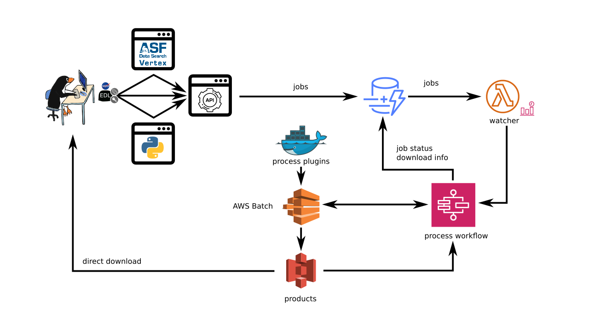

# How it Works

HyP3 is built around three core concepts: Platform, Plugins, and Products.

## Platform

The HyP3 platform makes it easy for users to request processing, monitor their requests, and download processed
products. The platform delegates each processing request to a plugin on the user's behalf. A deployment of the HyP3
platform can be integrated with any number of plugins.

## Plugins

Plugins are the workhorses of HyP3. Each plugin implements a particular processing workflow and
produces a product. At their most basic level, HyP3 plugins are
[Docker containers](https://www.docker.com/resources/what-container){target=_blank}
that handle the entire processing workflow for a single product, including:

* Marshaling the required input data
* performing any needed transformations and computations on the data
* creating the final product
* uploading the product to an AWS S3 bucket for distribution

Plugins only need to define a simple interface (entrypoint) that HyP3 understands and is used to run the container.
By encapsulating the entire workflow for generating a single product, HyP3 can arbitrarily scale to meet user need.

## Products

Products are the end result of processing, typically one or more data files. For more information about
our current products, see our [products page](products.md).
